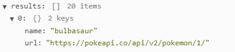
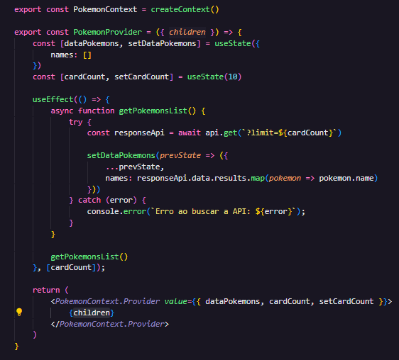
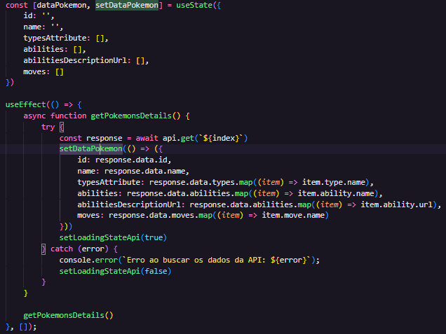
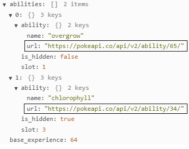
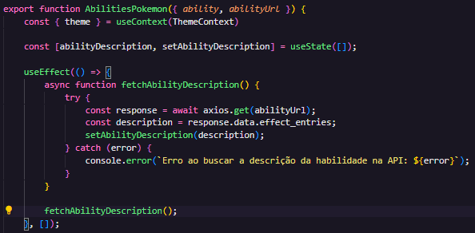

# Desafio React Avançado - Teste Técnico (DevQuest) | Projeto Pokédex

## Tabela do Conteudo

<ul>
<li><a href="#introdução">Introdução</a></li>
<li><a href="#objetivo">Objetivo</a></li>
<li><a href="#desafio">Desafio</a></li>
<li><a href="#status">Status e Layout</a></li>
<li><a href="#curiosidade">Curiosidade</a></li>
<li><a href="#tecnologias-utilizadas">Tecnologias</a></li>
<li><a href="#instalando-e-executando-o-projeto">Instalação</a></li>
<li><a href="#acessando-o-site">Acessando o site</a></li>
</ul>

## Introdução

Esse desafio faz parte do curso DevQuest, ele serve para nos desafiarmos e nos preparar para futuros testes técnicos no mercado de trabalho. Desenvolvi este projeto através dos conteúdos ensinados no curso e entre outras pesquisas.

## Objetivo

Criar uma página inicial de listagem de alguns pokemons, utilizando a api [https://pokeapi.co/](https://pokeapi.co/) e criar uma página interna de detalhes do pokemon.

<li>Neste projeto contém as seguintes informações:<br><br>

    1. A home apresenta uma listagem com 10 pokemons iniciais; ✅

    2. Na home, contém a baixo da lista, um botão "Carregar mais" que quando clicado, busca mais 10 pokemons e adiciona a listagem atual; ✅

    3. Essas listagens mostra a imagem e o nome de cada pokemon; ✅

    4. Na listagem, ao clicar em cada pokemon, vai exibir um container de informações detalhadas sobre o pokemon, como: ✅
        - Tipo do pokemon (type). ✅
        - Lista de movimentos do pokemon (moves); ✅
        - Lista de habilidades do pokemon (abilities); ✅
        - Na lista de habilidades apresenta o nome e o texto
    descritivo da habilidade. ✅


<li>Foram aplicados os seguintes requistos técnicos:<br><br>

    1. Single Page Application (SPA); ✅

    Exibindo todo o conteúdo que o usuário deseja em uma única página, sem recarregar.

    2. React.js; ✅
    
    Desenvolvimento prático, flexível e dinâmico da aplicação.
    
    3. Context API; ✅
    
    Criação do Theme Toggler, para alternar entre os tema claro e escuro de forma global e PokemonContext, para usar dados recebidos da PokeAPI de forma global.
  
    4. Styled Components; ✅
    
    Para melhor estilização dos componentes e de fácil manutenção.
    
    5. React Router Dom. ✅
    
    Para uma melhor navegação entre as páginas de modo Single Page Application (SPA).

## Desafio

Durante o desenvolvimento desse projeto, meu maior desafio foi em como eu iria armazenar da melhor forma os dados requisitados da API e compartilhar com meus demais componentes, pensando nisso eu implementei a seguinte solução:

  - Criei um contexto onde eu fiz a chamada para API, e com ela eu pude armazenar os nomes de cada pokemon da API, pois a URL principal só me retornava apenas 2 resultados;

     

  - No meu contexto também pude salvar o estado da quantidade de pokemons que será exibido inicialmente em minha HomePage. Na home, eu alterei o estado a cada novo clique no botão 'Carregar mais' acrescentando mais 10 pokemons.

    

O segunto ponto desafiador foi em armazenar os dados de cada pokemon:

  - Nesse código eu crio um array de objetos com cada dado do pokemon que está sendo identificado pelo `index`, e exibindo na tela no `return` abaixo.

    

Terceiro e último ponto importante do meu código, foi ao acessar os dados de descrição de cada habilidade do pokemon:

  - No componente `dataPokemon` eu já tinha armazenado a url de cada habilidade;

  

  - Então eu criei um `useEffect` para acessar essa nova URL de habilidades e buscar seus dados do servidor, então adicionei em um novo estado sua descrição, também está sendo retornado neste novo componente o valor da habilidade `ability`;

  

  - Com isso para cada habilidade que o pokemon tiver, esse componente receberá os dados do componente pai e será mapeado para mostrar em tela o título e a descrição da habilidade.

## Status

Desafio concluído. 🥰

### Layout Desktop / Mobile


## Curiosidade

Foi muito gratificando ver que depois de muita luta eu consegui fazer funcionar, e acredito que meu código está cada vez mais próximo de um código limpo comparado com meus projetos anteriores, estou começando a estudar Clean Code e SEO.

## Tecnologias utilizadas

- HTML
- CSS
- JavaScript
- React
- React Router Dom
- Context API
- Styled Components
- Axios
- Bootstrap Icons
- GIT

<!-- - [@vitejs/plugin-react](https://github.com/vitejs/vite-plugin-react/blob/main/packages/plugin-react/README.md) uses [Babel](https://babeljs.io/) for Fast Refresh
- [@vitejs/plugin-react-swc](https://github.com/vitejs/vite-plugin-react-swc) uses [SWC](https://swc.rs/) for Fast Refresh -->

## Instalando e executando o projeto

1º Clone o repositório do projeto em HTTPS ou SSH com sua SSH key

HTTPS
```bash
  git clone https://github.com/tiago-forward/desafio-react-avancado-pokedex.git
```

SSH
```bash
  git clone git@github.com:Igor-progm/app-pokedex-quest-react-avancado.git
```

Em sua máquina, crie uma nova pasta e execute o git, e em seguida cole um dos links acima.
<br>

2º Entre no diretório do projeto na qual foi clonado

```bash
  cd desafio-react-avancado-pokedex
```

3º Execute o comando abaixo para instalar todas as dependências utilizadas

```bash
  npm install
```

4º Inicialize a aplicação para ver o código funcionando na web

```bash
  npm run dev
```

## Acessando o site

Para acessar meu projeto online, acesse esse link : <a href="https://desafio-react-avancado-pokedex.vercel.app/" target="_blank">Desafio React Avançado | Projeto Pokédex</a>